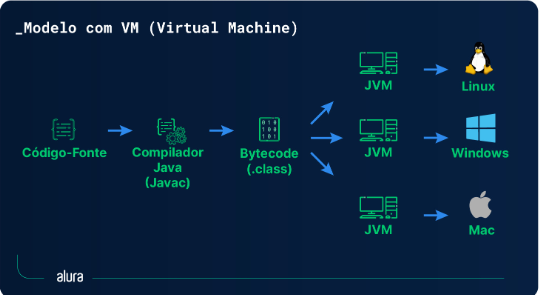
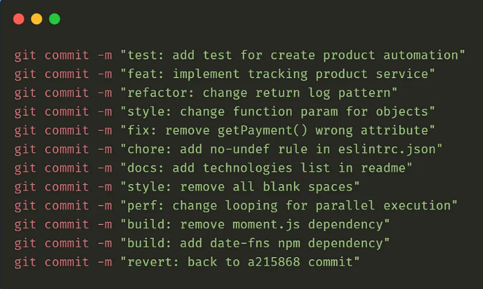

## *Opa, me chamo Arthur*
 Estou estudando Java com base no curso DevDojo do Youtube,
Comecei dia 26/03/2025.

Processo de Compilação em Java :
  O Java possui um processo de compilação diferente de linguagens como C e C++, pois não gera diretamente código de máquina. O fluxo do processo é o seguinte:

Escrita do Código Fonte:

  O programador escreve o código em um arquivo com extensão .java.

Compilação pelo javac:

  O compilador do Java (javac) converte o código fonte em bytecode, um formato intermediário independente da plataforma.

  O resultado é um arquivo .class, contendo instruções que a JVM pode interpretar.

Execução pela JVM:

  A Java Virtual Machine (JVM) lê o bytecode e o executa, traduzindo as instruções para o sistema operacional e processador específicos.

  A JVM pode utilizar Just-In-Time (JIT) Compilation, otimizando o desempenho ao converter partes do bytecode em código de máquina nativo durante a execução.

Por que a JVM é chamada de Multiplataforma?
  A JVM é considerada multiplataforma porque permite que um programa Java seja escrito uma única vez e executado em diferentes sistemas operacionais sem precisar ser recompilado. Isso acontece porque:

  O compilador Java (javac) gera bytecode em vez de código de máquina específico.

Esse bytecode pode ser interpretado e executado por qualquer JVM compatível, independentemente do sistema operacional ou hardware.

Como resultado, um mesmo arquivo .class pode rodar em Windows, Linux, macOS, etc., desde que haja uma JVM instalada.

Isso implementa o princípio "Write Once, Run Anywhere" (Escreva uma vez, execute em qualquer lugar).

Exemplos de git commit conventional a serem seguidos:
